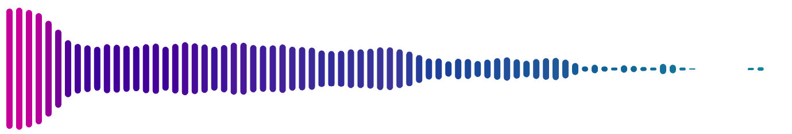

# React-viz-audio


Audio visualizer for audio samples in React

Supported sources: HTML Audio Element, Audio File (src), Audio Media devices (microphone)


## Installation

```sh
npm install viz-audio
```

## Usage

### With microphone input

```tsx
import { MickInputVisualizer } from 'viz-audio';

export default function App() {
  return <MickInputVisualizer height={300} width={400} />;
}
```

### With audio element

```tsx
import { AudioVisualizer } from 'viz-audio';

export default function App() {
  const [audioElement, setAudioElement] = useState<HTMLAudioElement | null>(
    null,
  );

  return (
    <>
      <audio controls src="demo.mp3" ref={setAudioElement}></audio>
      {audioElement && (
        <AudioVisualizer height={300} width={400} audioSource={audioElement} />
      )}
    </>
  );
}
```

### With audio file src

```tsx
import { AudioVisualizer } from 'viz-audio';

export default function App() {
  return (
    <AudioVisualizer height={300} width={400} audioSource={'./demo.mp3'} />
  );
}
```

## Props

- `barGap` - Gap between the graph's bars, in pixels. `number`

  `10` Gap
  

  `0` No gap
  

- `borderRadius` - Corner radius of the graph's bars, in pixels. `number`

  `0` Radius
  

- `centered` - Whether the graph should be centered. `boolean`

  `true` - The graph will be centered.
  
  `false` - The graph will not be centered.
  

- Colors

Each bar gets a solid rgb color, based on the bar's height and its index. You can change the color of the bars by setting the `redFactor`, `greenFactor` and `blueFactor` props.

> 🚧 Plan to add more options in the future to customize the color of the bars.

- `redFactor` - Red amount of the color of the graph's bars. `number`
- `greenFactor` - Green amount of the color of the graph's bars. `number`
- `blueFactor` - Blue amount of the color of the graph's bars. `number`

Examples

- redFactor: 5, greenFactor: 250, blueFactor: 170
  
- redFactor: 500, greenFactor: 500, blueFactor: 200
  
- redFactor: 100, greenFactor: 100, blueFactor: 100
  
